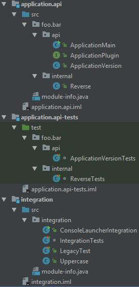
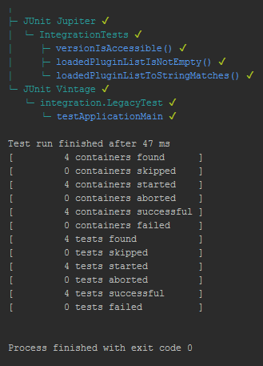

# junit5-idea-java9-consumer

The `junit5-idea-java9-consumer` project demonstrates how to run tests based on
JUnit Platform standalone distribution using IDEA in the a modular environment.

This sample project does not aim to demonstrate how to use the JUnit Jupiter APIs.
For detailed  information on the JUnit Jupiter programming and extension models,
please consult the [User Guide](http://junit.org/junit5/docs/current/user-guide/).


## overview



This project hosts 2 (two) Java/IDEA modules **with** module descriptors:

- `application.api` with the following `module-info.java`:
```java
module application.api {
  exports foo.bar.api;
  uses foo.bar.api.ApplicationPlugin;
  provides foo.bar.api.ApplicationPlugin with foo.bar.internal.Reverse;
}
```

- `integration` with the following `module-info.java`:
```java
module integration {
  requires application.api;
  requires junit.platform.console.standalone;
  opens integration to junit.platform.console.standalone;
  provides foo.bar.api.ApplicationPlugin with integration.Uppercase;
}
```

There's also a simple IDEA module **without** a module descriptor:

- `application.api-tests`

It contains the (unit) tests in a legacy-way-compatible manner:

- no `module-info.java`
- just an IDEA-style `test` source folder with a *test scope* dependency to
  `application.api`
- adds `junit-platform-console-standalone-1.0.0-M4.jar` to module path, which
  is automatically transformed into module `junit.platform.console.standalone`
- tests are defined in same packages as their tested classes: don't fear the
  split, package!
- duplicates the service provision information from `application.api` by using
  an entry in `META-INF/services` folder

## shared run configurations

https://github.com/sormuras/application-junit5-jdk9-demo/tree/master/.idea/runConfigurations

### run ApplicationMain
```
jdk-9/bin/java

 -p [...]/target/idea/production/application.api

 -m application.api/foo.bar.api.ApplicationMain

ApplicationVersion 9.123
ApplicationPlugin: class foo.bar.internal.Reverse
'123' -> [Reverse] -> '321'
'abc' -> [Reverse] -> 'cba'
```

### run IntegrationMain
```
jdk-9/bin/java

 -p [...]/target/idea/production/integration
    [...]/target/idea/production/application.api
    [~m2]/junit-platform-console-standalone-1.0.0-M4.jar

 -m application.api/foo.bar.api.ApplicationMain

ApplicationVersion 9.123
ApplicationPlugin: class foo.bar.internal.Reverse
'123' -> [Reverse] -> '321'
'abc' -> [Reverse] -> 'cba'
ApplicationPlugin: class integration.Uppercase
'123' -> [Uppercase] -> '123'
'abc' -> [Uppercase] -> 'ABC'
```

### run ConsoleLauncherIntegration
```
jdk-9/bin/java

 -p [...]/target/idea/production/integration
    [...]/target/idea/production/application.api
    [~m2]/junit-platform-console-standalone-1.0.0-M4.jar

 -m integration/integration.ConsoleLauncherIntegration

 --scan-classpath
 --classpath target/idea/production/application.api
 --classpath target/idea/production/integration

```


## known issues

- When launching *Run 'All Test'* in `integration` service loading does not work.
- The single IDEA module `application.api-tests` can be configured as a part of
  `application.api` excluding `module-info.java` from compilation. I guess.
- Instead of using `--scan-classpath --classpath ... --classpath ...` command
  line options, the JUnit Platform ConsoleLauncher should support something like:
  `--scan-modulepath`
- Forwarding `integration.ConsoleLauncherIntegration` wrapper should not be
  necessary.